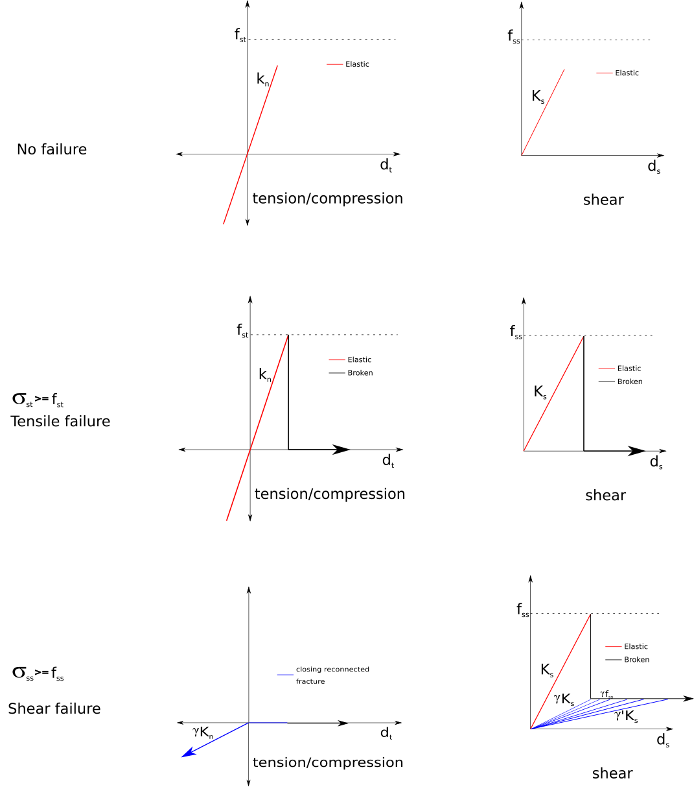
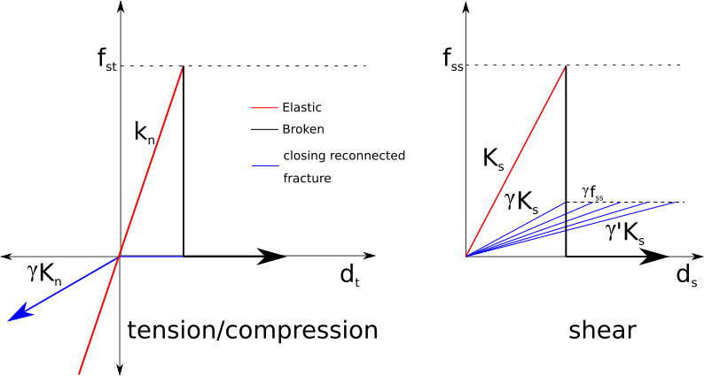
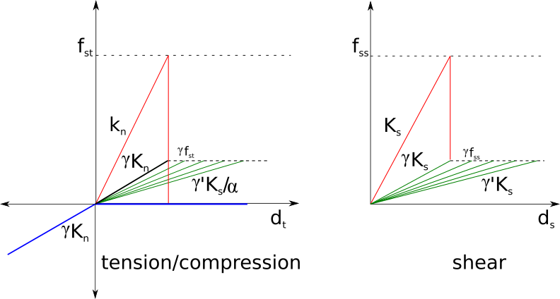

# Failure model

> Beam failure model

> Beam failure model (proposed)

# Current stiffness model

# Stiffness (proposed)

## Tensile failure

* Initial tensile / compression stiffness is $$k_n$$, when the element fails by tension (reaches the microscopic tensile strength $$f_{st}$$), the normal stiffness is drastically reduced to zero.

* After failure, when the displacement of the broken elements reaches zero (the original element length before breakage), a reduced normal compression stiffness is set as $$\gamma k_n$$. The tensile stiffness is still zero.

* The shear stiffness is reduced to $$k'_s = \gamma k_s$$, with a cap of $$\gamma f_{ss}$$.

## Shear failure

* When an element fails by shear, the initial shear stiffness $$k_s$$ is reduced to $$\gamma k_s$$, with a maximum shear strength of $$\gamma f_{ss}$$ as $$\gamma ' k_s$$. Thus, the tensile stiffness reduces by $$\gamma ' k_s / \alpha$$

* When the element reaches the reduced shear capacity of $$\gamma f_{ss}$$, the stiffness is reduced based on the average shear displacement.

* The normal stiffness (tension / compression) is reduced to $$\gamma k_n$$, when a element breaks in shear. With decrease in shear stiffness $$k'_s$$ based on the average shear displacement, the normal stiffness (tension / compression) is descreased as $$k'_s / \alpha$$.
